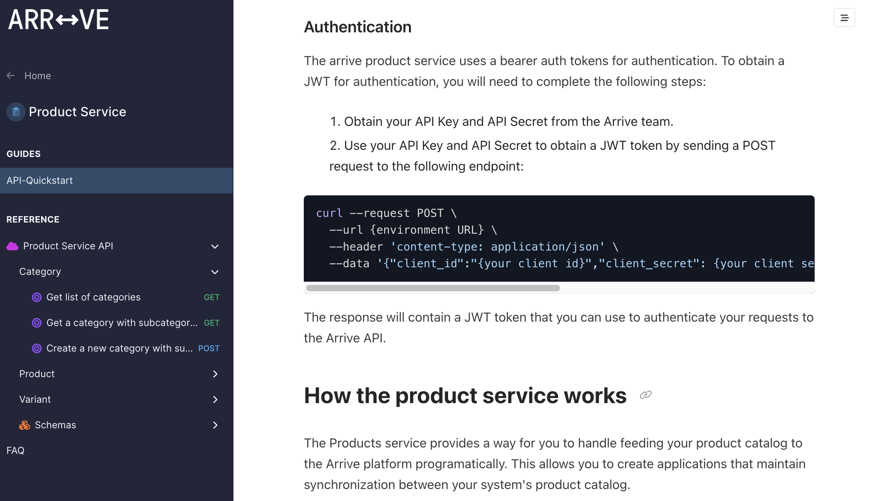
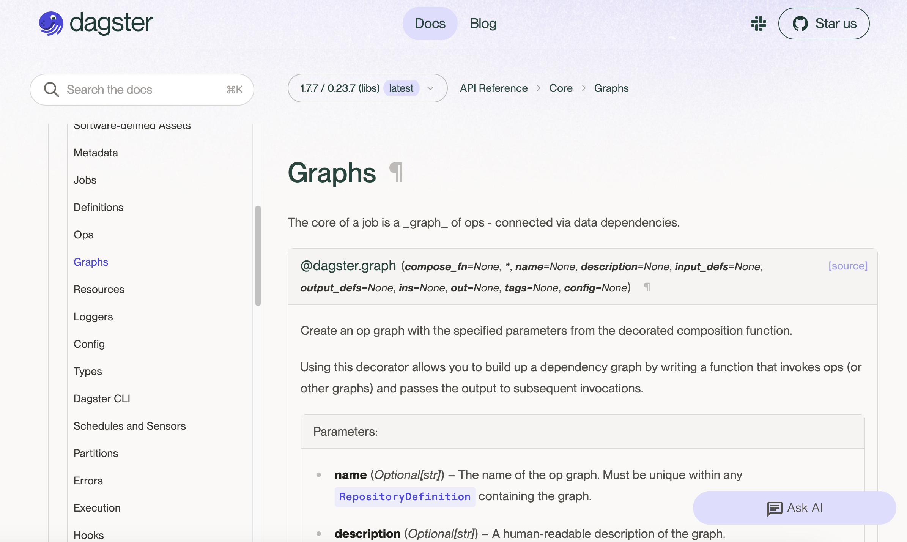
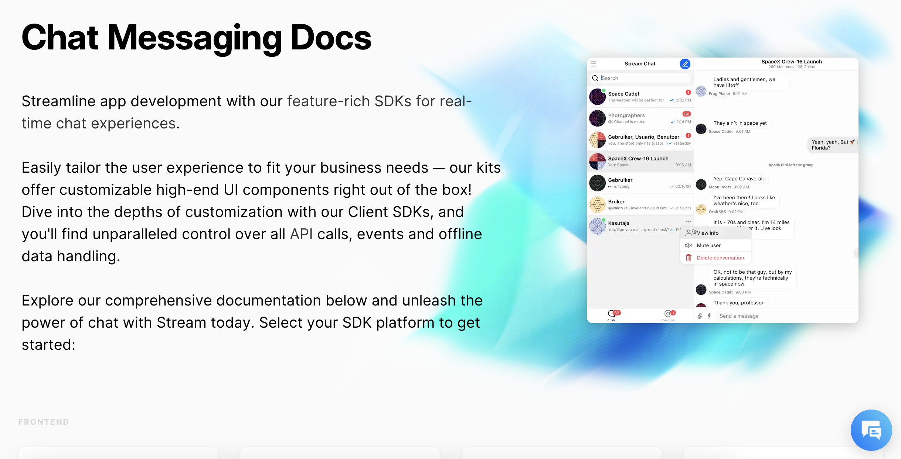
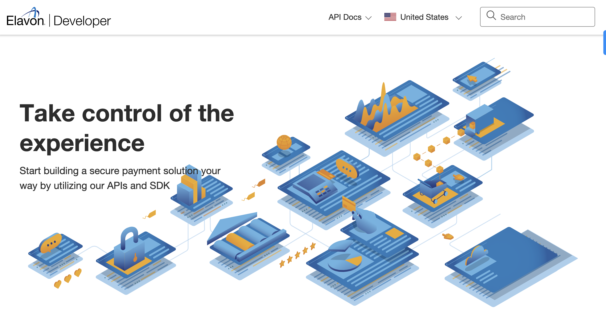
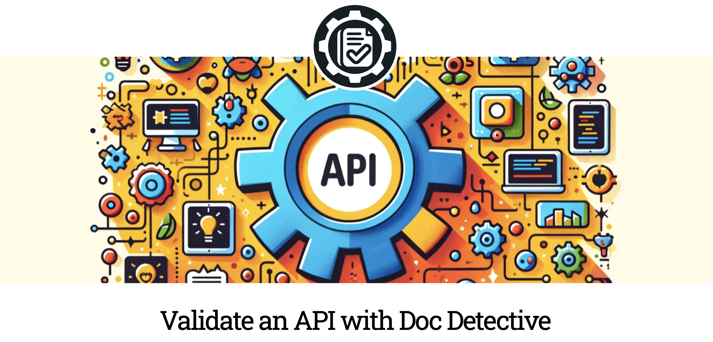
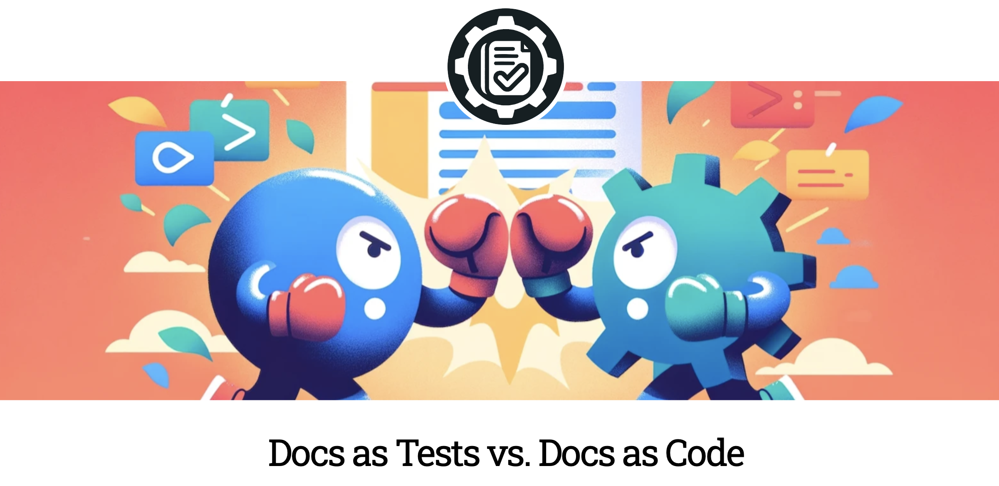

## Who am I?
My name is Niko, and the best title I've found for what I do is Developer Experience Specialist. I've been a technical writer, product manager, and developer focused on creating great developer experiences for the last decade. I've worked with companies ranging from Fortune 100 giants to teams of 20 people, helping them build and sell products for a highly technical audience.

## Developer Experience Consultant
With a decade of experience in developer and API products across multiple job titles, I help companies assess their developer experience holistically and make changes to software, content, and processes that help them unlock the value of their APIs.

### Arrive Recommerce

**What I did**: I helped Arrive Recommerce build their first developer portal and set of developer documentation for their new API as they prepared to go to market.

**How I did it**: I selected a platform with a low chance of lock-in and easy setup to enable the team to get their API to market as fast as possible. Then, I worked with the team to create a baseline set of documentation. Finally, I worked with the sales team to align on the value their team was selling and built documentation that showed the technical steps to achieving that value.

**What the results were**: The Arrive Recommerce team was able to launch their API with a developer portal that made it easy for partners to get started with their API and successfully onboarded their first API-focused integration partners.

[See the Arrive Recommerce Developer Portal](https://developer.thearriveplatform.com/)

### Dagster

**What I did**: I worked as a front-end developer and helped Dagster polish the look and feel of their developer portal and documentation to create an all-around better developer experience. Then, I helped overhaul their authoring toolchain to make it easier for the team to create and maintain their documentation.

**How I did it**: A little CSS goes a long way. After I thoroughly audited the existing documentation and tested it at multiple viewport sizes, I made a series of updates to the CSS to give the documentation a clean look and feel that matched the high quality of the content.

**What the results were**: One of the most common complaints about Dagster's documentation was that it was very difficult to use their API reference. After updating their theming, complaints about API reference readability dropped to zero.

[See the Dagster Developer Portal](https://docs.dagster.io/getting-started)

## Product Manager of Developer Portals
I've been the product manager of the developer portals for the companies Stream Inc and Elavon. During my tenure, I worked alongside designers, developers, and technical writers to create a developer experience that maximized the value of the company's APIs.

### Stream Developer Portal

**What I did**: I helped Stream dramatically improve the quality of their developer documentation experience for their SDK and UI framework products.

**How I did it**: I changed the tools and practices for developer documentation to enable an already strong engineering team to create great documentation in a fraction of the time. I also launched new developer sites for each UI framework that provided the documentation in the idiom of the framework's users.

**What the results were**: After the launch of the new developer portals, Stream saw a sharp increase in their NPS for their developer experience and a significant increase in the number of developers who were able to get started with their APIs.

[See the Stream Developer Portal](https://getstream.io/chat/docs/)

### Elavon Developer Portal

**What I did**: Over the course of three years, I helped Elavon move from a legacy closed documentation approach to a modern, public developer portal.

**How I did it**: As a technical writer, I helped develop scripts for migrating from legacy docs to a Docs as Code toolchain. As a product manager, I worked with the team to develop a new developer portal that was public-facing, accessible, and easy to find content in.

**What the results were**: After the launch of the new developer portal, Elavon saw a significant decrease in the number of support tickets related to common implementation questions and an increase in self-service success rates for implementations.

[See the Elavon Developer Portal](https://developer.elavon.com/)

## Docs as Tests Contributor
**What I did**: Helped create content and tutorials promoting the emerging practice of Docs as Tests.

**How I did it**: Worked side by side with the Docs as Tests codifier and creator of the Doc Detective tool to create tutorials and articles that help developers and technical writers understand how to apply Docs as Tests to their own projects.

**What the results were**: Docs as Tests saw a significant increase in site traffic, and the Doc Detective tool acquired its first two corporate users.

Feel free to read more at [Docs as Tests website](https://www.docsastests.com/)

### How to test an API with Doc Detective

My recent tutorial work includes guides on how to apply Docs as Tests to API products. In this tutorial, I show the basics of setting up Doc Detective to validate an API.

[Read the tutorial](https://www.docsastests.com/validate-api-with-doc-detective)

### Docs as Tests vs Docs as Code

In addition to writing tutorials for Docs as Tests, I also make contributions to the field of practice around Doc Ops. This article discussing how Docs as Tests relates to Docs as Code and where both fit into the broader Doc Ops landscape is one example.

[Read the article](https://www.docsastests.com/docs-as-tests-vs-docs-as-code)

## Recent Solo Work
I've also been doing some solo work on the side to keep my skills sharp and learn new things. Here are a few examples of what I've been up to.

### Game Score API
As part of some coursework, I had to put together an API that could track the scores players got in web games. I took a design-first approach and wrote the API documentation before writing the code. You can read the Open API reference docs under the API tab of this site.

[Read the API reference](/api-reference)

### Simplest API Ever
As part of recent computer science coursework, I put together the absolute simplest possible API using Express and made a tutorial of the process.

[Read the tutorial](/docs/simplest-api)
